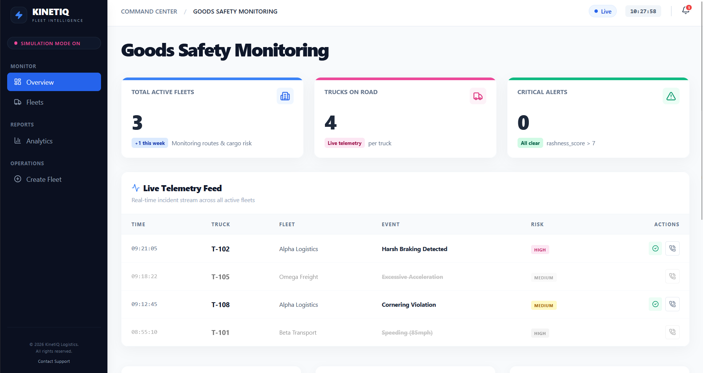

# KinetiQ

**Context-Aware Fleet Tracking for Optimal Routing and Driver Evaluation**

Live demo: https://kineti-q-hutb.vercel.app/



KinetiQ reads vehicle motion data from IMU and GPS sensors to tell driver-caused anomalies
apart from road-caused ones, so fleets can route cargo more sensibly, crowd-map road quality,
and score drivers fairly.

## The problem

Most tracking systems can tell you that cargo got bumped, but not why. Was the driver careless,
or was it just a bad road? Without that context, companies absorb cargo-damage losses and end up
penalizing safe drivers for road hazards they couldn't avoid.

## Our solution

KinetiQ combines edge motion sensing with fleet-wide analytics to separate road-caused anomalies
from driver-caused ones, moving from absolute metrics toward contextual accountability.

**How it works**

- **Data capture:** IMU and GPS sensors track vertical jolts, harsh braking, and sharp cornering.
- **Contextual analytics:** The system cross-references telemetry across many vehicles. If one
  truck shakes on a stretch of road, that points to aggressive driving; if ten trucks all jolt at
  the same GPS point, the road is the problem, not the drivers.
- **Crowdsourced road mapping:** Ordinary delivery fleets double as real-time road-quality
  scanners, so no dedicated surveying equipment is needed.

**Core outcomes**

- **Cargo-aware routing:** Fragile shipments are sent along the lowest-"jitter" paths, while
  durable goods take the fastest route.
- **Driver Trust Network:** A "Driver Reliability Score" built only from preventable actions (like
  hard braking on a road known to be smooth), so driver analytics stay fair and fine-grained. That
  helps with hiring, retention, and rewarding good driving.

## What's implemented in this repository

This repo is the software platform: the analytics backend, the ML model, and the dashboard.

- **Backend** (`backend/app.py`) is a Flask REST API of roughly 18 endpoints. It ingests IMU data,
  simulates fleet deliveries, detects anomalies, computes driver scores, and serves cargo-aware
  "safe" and "standard" routes. Routing goes through the public OSRM service (OpenStreetMap), with
  results cached on disk.
- **ML** (`train.py`, `inject_jerk_data.py`) trains a TensorFlow/Keras CNN
  (`kinetiQ_outputs/kinetiQ_cnn.keras`) on IMU and jerk signals to classify driving and road
  events. Sample outputs live in `kinetiQ_outputs/`.
- **Frontend** (`frontend/`) is a React 19 dashboard built with Vite, using Leaflet for maps and
  Recharts for charts (fleet map, truck dashboard, delivery analytics, driver scores).

The IMU signals here come from a recorded sensor dataset. The wider system (live edge capture on
ESP32, MQTT ingestion, and so on) is a planned next phase, described under the roadmap below.

## Tech stack

- **Backend:** Python, Flask, flask-cors, pandas, requests, OSRM routing, gunicorn
- **ML:** TensorFlow / Keras, NumPy, scikit-learn, SciPy, matplotlib
- **Frontend:** React 19, Vite, React Router, Leaflet / react-leaflet, Recharts, Tailwind CSS, axios
- **Deploy:** Vercel (frontend), Render (backend)

## Future roadmap

The full product we pitched at the hackathon, beyond what this repo implements today:

- **Edge:** ESP32 microcontroller, 6-axis IMU, GPS, and camera, with lightweight on-device object
  detection (YOLOv8 Nano)
- **Data and cloud:** MQTT ingestion, AWS/GCP hosting, time-series storage on InfluxDB
- **Analytics engine:** Python spatial-clustering algorithms over fleet-wide telemetry

## Repository structure

```
backend/                Flask API and cached OSRM routes
frontend/               React dashboard (Vite)
train.py                CNN training
inject_jerk_data.py     jerk-data augmentation
kinetiQ_outputs/        trained model and result images
requirements.txt        ML/Python dependencies
```

## Running locally

**Backend**
```bash
cd backend
pip install -r requirements.txt
flask --app app run            # http://localhost:5000
```

**Frontend**
```bash
cd frontend
npm install
npm run dev                    # http://localhost:5173
```

Point `VITE_API_BASE_URL` at your backend (it falls back to the hosted one).

## Demo and presentation

- Live app: https://kineti-q-hutb.vercel.app/
- Demo video: https://drive.google.com/file/d/1FWZgvvy2M3IS7dlfhuthK8ci1dofduDa/view?usp=sharing
- Slide deck: https://docs.google.com/presentation/d/1KJlFVj2gK2clvJ_tfr2qGs5vx9sExIkk/edit?usp=share_link

## Team

Built together at the DP World Hackathon, April 2026.

- Shriyam Avasthi - [@Shriyam-Avasthi](https://github.com/Shriyam-Avasthi)
- Akarsh Jain - [@Akarsh-09](https://github.com/Akarsh-09)
- Archit Jindal - [@Archie0099](https://github.com/Archie0099)
- Atchyut Bhallamudi - [@atchyutbhallamudi](https://github.com/atchyutbhallamudi)
- Vikranth Reddy - [@Vik217](https://github.com/Vik217)
